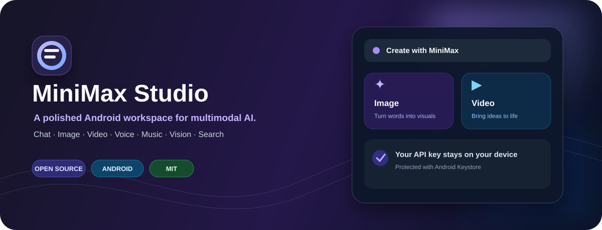

<div align="center">



<h1>MiniMax Studio</h1>

<p><strong>一个简洁、原生、开源的 Android MiniMax 全模态客户端。</strong></p>

<p>
  <a href="https://github.com/cndoin/minimax-studio-android/releases/download/v1.0.0/MiniMaxStudio-v1.0.0-debug.apk"><strong>⬇ 直接下载 APK</strong></a>
  &nbsp;·&nbsp;
  <a href="#快速开始">开始构建</a>
  &nbsp;·&nbsp;
  <a href="https://github.com/cndoin/minimax-studio-android/issues">反馈问题</a>
  &nbsp;·&nbsp;
  <a href="CONTRIBUTING.md">参与贡献</a>
</p>

<p>
  
  
  
  <a href="https://github.com/cndoin/minimax-studio-android/actions/workflows/android.yml"></a>
  <a href="LICENSE"></a>
</p>

</div>

> 把 MiniMax 的文本、图像、视频、语音、音乐、视觉理解和网络搜索能力，收进一个漂亮而克制的 Android 工作台。

## 为什么是 MiniMax Studio？

它不是一个复杂的后台面板，而是一个专注于创作和试用的原生 Android 客户端：打开应用，填入自己的 API Key，就可以在同一个空间里对话、创作、查看结果和管理用量。

## 功能矩阵

<div align="center">

|  | 模块 | 能力 |
| :---: | --- | --- |
| 💬 | **对话** | MiniMax-M2.7、M2.5、M2.1、M3 |
| ✦ | **图片** | 文生图、画幅选择、1–4 张批量生成 |
| ▶ | **视频** | Hailuo-2.3、MiniMax-H3、任务轮询与结果打开 |
| ◉ | **语音** | Speech 2.8 HD，支持本地音频试听 |
| ♫ | **音乐** | Music 3.0、描述与歌词 |
| ◌ | **视觉** | 公网图片 URL / `file_id` 图片理解 |
| ⌕ | **搜索** | Token Plan 网络搜索与结果跳转 |
| ◈ | **安全** | Android Keystore 加密保存 API Key |

</div>

## 直接下载

不想自己构建？下载已经验证过的 Android 安装包：

<div align="center">

### [⬇ 下载 MiniMax Studio v1.0.0 APK](https://github.com/cndoin/minimax-studio-android/releases/download/v1.0.0/MiniMaxStudio-v1.0.0-debug.apk)

</div>

这是一个未签名的 Debug 构建，适合体验和测试。安装前请在 Android 设置中允许当前浏览器或文件管理器安装应用。APK 同时附在 [v1.0.0 Release](https://github.com/cndoin/minimax-studio-android/releases/tag/v1.0.0) 中，方便直接下载。

<details>
<summary>校验文件完整性</summary>

```text
SHA-256: 7B1CC746A889BCA1BA0260B26ECF1CEDB0BBF7EE8C6940E7E3C5E8E09A70BA2B
```

</details>

## 快速开始

### 运行要求

- Android Studio 最新稳定版
- JDK 17
- Android SDK 35
- Android 8.0（API 26）或更高版本
- 一个可用的 MiniMax API Key

### 构建

```powershell
git clone https://github.com/cndoin/minimax-studio-android.git
cd minimax-studio-android
.\gradlew.bat :app:assembleDebug
```

构建完成后，APK 位于 `app/build/outputs/apk/debug/app-debug.apk`。也可以直接用 Android Studio 打开仓库根目录，等待 Gradle 同步后运行 `app` 配置。

首次启动后，打开“设置”，填写自己的 MiniMax API Key，并选择 API Key 对应的服务区域。

## 安全与隐私

```text
你的 Android 设备
      │
      ├── API Key ──▶ Android Keystore 加密存储
      │
      └── API 请求 ──▶ MiniMax 官方 API

本项目没有自有服务器，不收集 API Key，也不内置共享密钥。
```

- API 请求从应用直接发送到 MiniMax，不经过本项目的自有服务器。
- API Key 通过 Android Keystore 加密后保存在应用私有存储中。
- 如果设备无法使用 Android Keystore，应用不会把 API Key 回退保存为明文。
- MiniMax API 的调用可能产生费用，账号、额度和网络费用由使用者自行承担。
- 请勿在 Issue、截图、日志或 Pull Request 中公开 API Key、账号信息或个人数据。

## 项目结构

```text
.
├── app/
│   └── src/main/
│       ├── java/com/minimax/mobile/
│       │   ├── data/             # API 客户端、数据模型、Keystore 存储
│       │   ├── ui/               # ViewModel 与主题
│       │   └── MainActivity.kt   # Compose 入口与界面
│       └── res/                  # Android 资源、图标与主题
├── assets/hero.svg               # README 品牌横幅
├── downloads/                    # 可直接下载的 APK
├── .github/                      # CI、Issue 表单、PR 模板与维护配置
├── gradle/wrapper/               # Gradle Wrapper
├── CONTRIBUTING.md
├── SECURITY.md
└── README.md
```

## 开发与贡献

欢迎提交 Bug、功能建议和 Pull Request。请先阅读：

- [贡献指南](CONTRIBUTING.md)
- [安全策略](SECURITY.md)
- [变更记录](CHANGELOG.md)

本地提交前建议运行：

```powershell
.\gradlew.bat :app:assembleDebug
```

GitHub Actions 会在推送和 Pull Request 时自动执行 Debug 构建，Dependabot 会定期检查 Gradle 和 GitHub Actions 依赖。

## 常见问题

<details>
<summary><strong>为什么应用提示 API Key 无效？</strong></summary>

请检查 API Key 是否完整、是否选择了正确的国内/国际区域，以及对应账号是否有可用额度。

</details>

<details>
<summary><strong>为什么生成的视频需要等待？</strong></summary>

视频接口是异步任务。应用会自动轮询任务状态，最长等待约 144 秒；超时后可以到 MiniMax 控制台查看任务。

</details>

<details>
<summary><strong>生成的图片或视频链接为什么会失效？</strong></summary>

媒体地址由 MiniMax 返回，具体有效期由 MiniMax 服务决定。重要内容请及时保存或下载。

</details>

## 路线图

- [x] 文本对话与多模型切换
- [x] 图片、视频、语音、音乐生成
- [x] 视觉理解与网络搜索
- [x] API Key 本地加密保存
- [x] 可直接下载 APK
- [ ] 签名 Release 构建与版本发布流程
- [ ] 更丰富的媒体保存与分享能力
- [ ] 多语言界面

## 免责声明

MiniMax Studio 是 MiniMax API 的第三方客户端，不代表 MiniMax 官方立场。模型名称、接口路径、区域、返回格式和计费规则可能变化，请以 [MiniMax 官方文档](https://platform.minimaxi.com/docs) 为准。

## 许可证

本项目采用 [MIT License](LICENSE)。

<div align="center">

<br>

如果这个项目对你有帮助，欢迎点一个 ⭐ Star，或者提交 Issue 分享你的想法。

</div>
